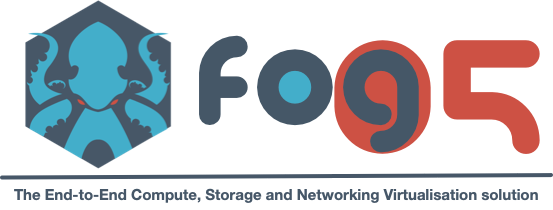

<!-- 
 -->

# Eclipse fog05
The End-to-End Compute, Storage and Networking Virtualisation solution.

Eclipse fog05 is an open source project that aims at providing a decentralised infrastructure for provisioning and managing compute, storage, communication and I/O resources available anywhere across the network. Eclipse fog05 addresses highly heterogeneous systems even those with extremely resource-constrained nodes.

Check the website [fog05.io](https://fog05.io) for more detailed information

### Contributing

If you want to contribute, please read information in [CONTRIBUTING.md](./CONTRIBUTING.md)

#### Use cases
In this section is possible to find some intresting use cases based on Eclipse fog05.

- Deploy of distributed Machine Learning architectures [Davide-DD/fog05-orchestrator](https://github.com/Davide-DD/fog05-orchestrator)
- VIM for Constrained Devices and ETSI MEC/NFV Convergence [5GCity/5GCity-multi-tier-orchestration](https://github.com/5GCity/5GCity-multi-tier-orchestration)
- Robotic Application Deployment [5GCoral YouTube - UC3M](https://www.youtube.com/watch?v=fyA7UKe494A)
- Edge Computing deployment for VR/AR Applications [InterDigital YouTube](https://www.youtube.com/watch?v=Wb1E4ViOY1s)

